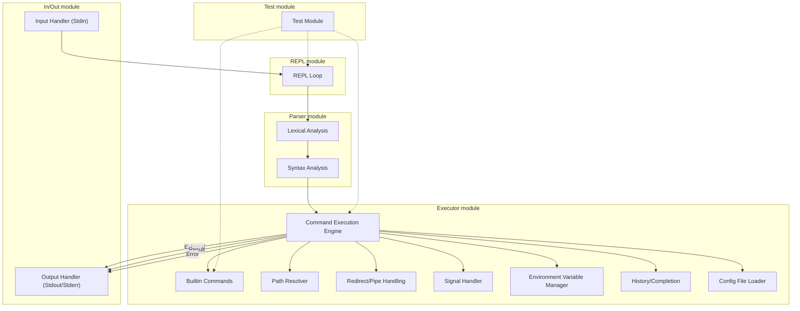
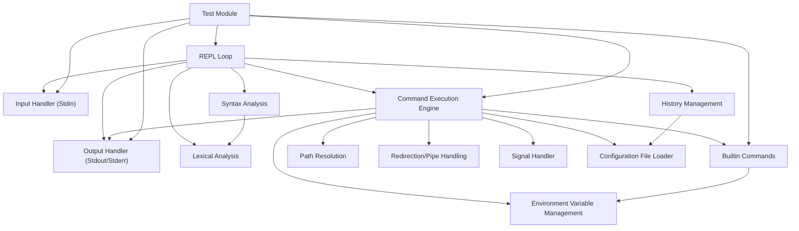

# Design Document

## Purpose / Policy

- For study purpose
- Scalability, Consistency, Testability

## Architecture Overview





## Module Structure

```
src/                               //
├── main.rs                        // Entry point
├── lib.rs                         // Core logic (module management)
├── repl.rs                        // REPL loop: input handling/output control
├── lexer/                         //
│   ├── mod.rs                     //
│   └── lexer.rs                   // Lexical analysis
├── parser/                        //
│   ├── mod.rs                     //
│   ├── parser.rs                  // Parser main
│   └── ast.rs                     // Abstract Syntax Tree (AST) definitions
├── executor/                      //
│   ├── mod.rs                     // Command execution engine
│   ├── command.rs                 // External command launching
│   ├── builtin.rs                 // Built-in commands
│   ├── path_resolver.rs           // Path resolution
│   ├── redirect.rs                // Redirection/pipe processing
│   ├── signal.rs                  // Signal handler
│   ├── recursive_executor/        //
│   │   ├── mod.rs                 //
│   │   ├── redirect.rs            //
│   │   └── recursive_executor.rs  //
│   └── flatten_executor/          //
│       ├── mod.rs                 //
│       ├── flatten_ast.rs         //
│       └── flatten_executor.rs    //
├── io/                            //
│   ├── input.rs                   // Standard input wrapper
│   └── output.rs                  // Standard output/error wrapper
├── env.rs                         // Environment variable management
├── history.rs                     // History/completion
├── config.rs                      // Config file loader
├── error.rs                       // Error handling
└── tests/                         //
    ├── mod.rs                     // Test coordinator
    └── ...                        // Module-specific tests
```

## Public API

### lexer

```rust
pub struct Lexer;
pub enum TokenKind;
pub struct Token {
    pub kind: TokenKind,
    pub lexeme: String,
    pub span: (usize, usize),
}
pub enum LexError;
pub fn tokenize(input: &str) -> Result<Vec<Token>, LexError>;
```

### ast

```rust
pub enum AstNode {
    Command(CommandNode),
    Pipeline(Box<AstNode>, Box<AstNode>),
    Redirect {
        node: Box<AstNode>,
        kind: RedirectKind,
        file: String,
    },
    Sequence(Box<AstNode>, Box<AstNode>),
    And(Box<AstNode>, Box<AstNode>),
    Or(Box<AstNode>, Box<AstNode>),
    Subshell(Box<AstNode>),
    // Compound, If, For, ...
}
pub struct CommandNode {
    pub name: String,
    pub args: Vec<String>,
    pub kind: CommandKind,
}
pub enum CommandKind {
    Simple,
    Builtin,
    External,
}
pub enum RedirectKind {
    In,
    Out,
    Append,
}
```

### parser

```rust
pub trait Parser {
    fn parse(&mut self) -> Result<AstNode, ParseError>;
}
pub struct DefaultParser<'a> {
    tokens: &'a [Token],
    pos: usize,
}
pub enum ParseError;
```

### executor

```rust
pub trait Executor {
    fn exec(&mut self, node: &AstNode, env: &mut Environment) -> ExecStatus;
}
pub struct DefaultExecutor;
pub type ExecStatus = Result<i32, ExecError>;
pub enum ExecError;
```

### executor/builtin

```rust
pub trait BuiltinCommand {
    fn name(&self) -> &'static str;
    fn execute(&self, args: &[String], env: &mut EnvManager) -> Result<i32, ExecError>;
}
pub struct BuiltinRegistry;
impl BuiltinRegistry {
    pub fn register(&mut self, cmd: Box<dyn BuiltinCommand>);
    pub fn find(&self, name: &str) -> Option<&Box<dyn BuiltinCommand>>;
}
```

### executor/path_resolver

```rust
pub struct PathResolver;
impl PathResolver {
    pub fn resolve(&self, command: &str) -> Option<std::path::PathBuf>;
}
```

### executor/redirect

```rust
pub struct RedirectHandler;
impl RedirectHandler {
    pub fn handle_redirect(&self, node: &AstNode) -> Result<(), ExecError>;
    pub fn handle_pipeline(&self, node: &AstNode) -> Result<(), ExecError>;
}
```

### executor/signal

```rust
pub struct SignalHandler;
impl SignalHandler {
    pub fn handle_signals(&self);
}
```

### repl

```rust
pub struct Repl;
impl Repl {
    pub fn run(&mut self);
}
```

### io/input

```rust
pub struct InputHandler;
impl InputHandler {
    pub fn read_line(&mut self, prompt: &str) -> std::io::Result<String>;
}
```

### io/output

```rust
pub struct OutputHandler;
impl OutputHandler {
    pub fn print(&mut self, s: &str);
    pub fn print_error(&mut self, s: &str);
}
```

### env

```rust
pub struct EnvManager;
impl EnvManager {
    pub fn get(&self, key: &str) -> Option<String>;
    pub fn set(&mut self, key: &str, value: String);
    pub fn unset(&mut self, key: &str);
    pub fn all(&self) -> Vec<(String, String)>;
}
```

### history

```rust
pub struct History;
impl History {
    pub fn add(&mut self, entry: &str);
    pub fn get(&self, index: usize) -> Option<&String>;
    pub fn last(&self) -> Option<&String>;
}
```

### config

```rust
pub struct ConfigLoader;
pub enum ConfigError;
impl ConfigLoader {
    pub fn load(&self, path: &str) -> Result<(), ConfigError>;
}
```

### error

```rust
pub enum ShellError {
    Io(std::io::Error),
    Lex(LexError),
    Parse(ParseError),
    Exec(ExecError),
    Config(ConfigError),
    // ...
}
```

