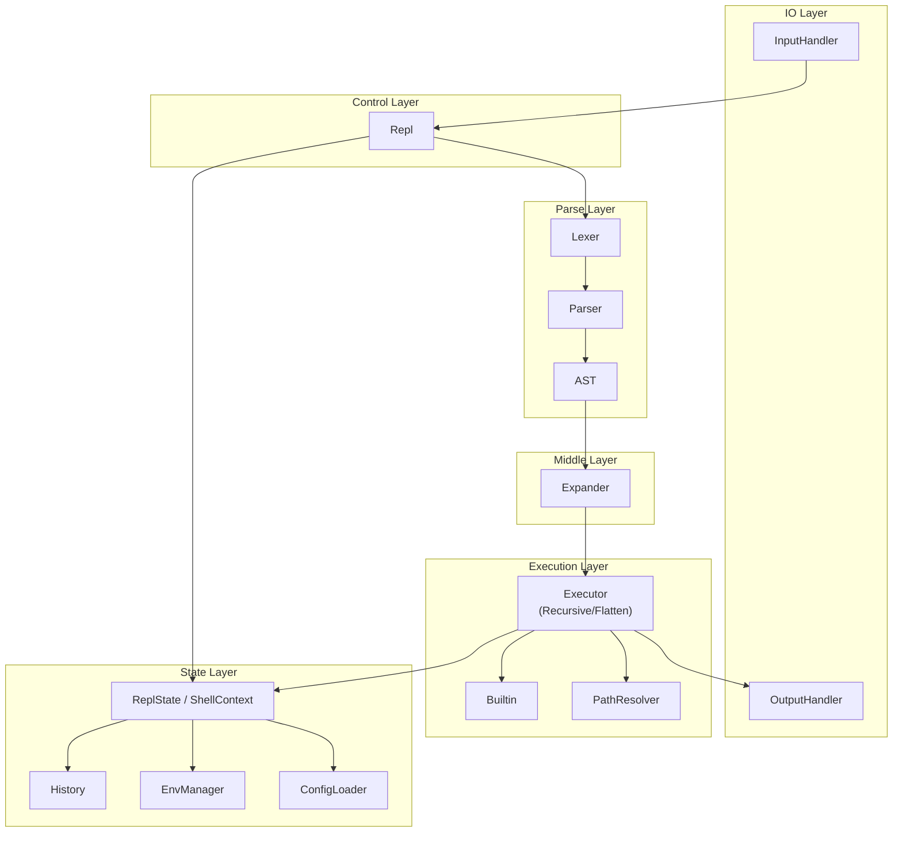

# Design Document

## Table of Contents

- [Architecture Overview](#architecture-overview)
- [Module Structure](#module-structure)
- [Public API](#public-api)
  - [repl](#repl)
  - [io/input](#ioinput)
  - [io/output](#iooutput-draft)
  - [ast](#ast)
  - [lexer](#lexer)
  - [parser](#parser)
  - [executor](#executor)
    - [executor/builtin](#executorbuiltinmanager)
    - [executor/path_resolver](#executorpath_resolver)
    - [executor/pipeline](#executorpipeline)
    - [executor/signal](#executorsignal)
    - [executor/recursive_executor](#executorrecursive_executor)
    - [executor/flatten_executor](#executorflatten_executor)
  - [state](#statedraft)
  - [env](#envdraft)
  - [history](#historydraft)
  - [config](#configdraft)
  - [error](#error)

## Architecture Overview

The architecture is organized into 6 distinct layers, each with clear responsibility and direction of data/control flow:

1. IO Layer  
   Handles communication with the user.
   - Components: InputHandler, OutputHandler

1. Parse Layer  
   Converts user input into an abstract syntax tree (AST).
   - Components: Lexer, Parser, AST

1. Middle Layer  
   Expands and transforms the AST before execution.
   - Components: Expander (e.g., variable substitution, command expansion)

1. Execution Layer  
   Executes the expanded command structures, manages system interaction.
   - Components: Executor (RecursiveExecutor / FlattenExecutor), Builtin, PathResolver

1. State Layer  
   Maintains shell runtime state such as environment variables, input history, and user configuration.
   - Components: ReplState / ShellContext (includes EnvManager, History, ConfigLoader)
   - Purpose: Acts as a shared, mutable context for both REPL and Executor phases

1. Control Layer  
   Orchestrates the full pipeline from input to output, coordinating all layers.
   - Components: Repl



## Module Structure

```
src/                               //
├── main.rs                        // Entry point
├── lib.rs                         // Core logic (module management)
├── lexer/                         //
│   ├── mod.rs                     //
│   ├── token.rs                   // Token definitions
│   └── lexer.rs                   // Lexical analysis
├── parser/                        //
│   ├── mod.rs                     //
│   ├── parser.rs                  // Parser main
│   └── default_parser.rs          // Default Parser
├── executor/                      //
│   ├── mod.rs                     // Command execution engine
│   ├── command.rs                 // External command launching
│   ├── builtin.rs                 // Built-in commands
│   ├── path_resolver.rs           // Path resolution
│   ├── pipeline.rs                // Pipeline Processing
│   ├── signal.rs                  // Signal handler
│   ├── builtin/                   //
│   │   ├── mod.rs                 //
│   │   ├── manager.rs             // Builtin Manager and Command trait
│   │   └── commands.rs            // Built-in commands
│   ├── recursive_executor/        //
│   │   ├── mod.rs                 //
│   │   ├── redirect.rs            // Redirection processing
│   │   └── recursive_executor.rs  //
│   └── flatten_executor/          //
│       ├── mod.rs                 //
│       ├── flatten_ast.rs         //
│       └── flatten_executor.rs    //
├── io/                            //
│   ├── input.rs                   // Standard input wrapper
│   └── output.rs                  // Standard output/error wrapper
├── state/                         //
│   ├── mod.rs                     //
│   ├── repl_state.rs              // Integrates Env, History, Config
│   └── state_store.rs             // Persistence support
├── repl.rs                        // REPL loop: input handling/output control
├── ast.rs                         // Abstract Syntax Tree (AST) definitions
├── env.rs                         // Environment variable management
├── history.rs                     // History/completion
├── config.rs                      // Config file loader
├── error.rs                       // Error handling
└── tests/                         //
    ├── mod.rs                     // Test coordinator
    └── ...                        // Module-specific tests
```

## Public API

### repl

```rust
pub struct Repl;
impl Repl {
    pub fn run();
}
```

### io/input

```rust
pub struct InputHandler;
impl InputHandler {
    pub fn read_line(prompt: &str) -> std::io::Result<Option<String>>;
}
```

### io/output (draft)

```rust
pub struct OutputHandler;
impl OutputHandler {
    pub fn print(&mut self, s: &str);
    pub fn print_error(&mut self, s: &str);
}
```

### lexer

```rust
pub enum TokenKind;

pub struct Token {
    pub kind: TokenKind,
    pub lexeme: String,
    pub span: (usize, usize), // For the UTF-8, Span type will be introduced in the future
}

pub struct Lexer {
  pub fn tokenize(input: &str) -> Result<Token, LexError>;
  pub fn tokenize_all(input: &str) -> Result<Vec<Token>, LexError>;
}

pub enum LexError;
```

### ast

```rust
pub enum AstNode {
    Command(CommandNode),
    Subshell(Box<AstNode>),
    Redirect {
        node: Box<AstNode>,
        kind: RedirectKind,
        file: String,
    },
    Pipeline(Box<AstNode>, Box<AstNode>),
    And(Box<AstNode>, Box<AstNode>),
    Or(Box<AstNode>, Box<AstNode>),
    Sequence(Box<AstNode>, Box<AstNode>),
    // Compound, If, For, ...
}

pub struct CommandNode {
    pub name: String,
    pub args: Vec<String>,
    pub kind: CommandKind,
}

pub enum CommandKind { Simple, Builtin, External }

pub enum RedirectKind { In, Out, Append }

pub enum CompoundNode { }
```

### parser

```rust
pub trait Parser {
    fn parse(&mut self) -> Result<AstNode, ParseError>;
}

pub struct DefaultParser<'a> {
    tokens: &'a [Token],
    pos: usize,
}

pub enum ParseError;
```

#### Priority of AST nodes (higher is closer to the leaf)

Sequence < And/Or < Pipeline < Redirect < Subshell < Command

#### AST node example

```rust
// Example 1: `ls -l > ls.txt; cat < ls.txt | grep "txt" | wc > output.txt`
let ast = AstNode::Sequence(
    Box::new(AstNode::Redirect {
        node: Box::new(AstNode::Command(CommandNode {
            name: "ls".to_string(),
            args: vec!["-l".to_string()],
            kind: CommandKind::External,
        })),
        kind: RedirectKind::Out,
        file: "ls.txt".to_string(),
    }),
    Box::new(AstNode::Pipeline(
        Box::new(AstNode::Redirect {
            node: Box::new(AstNode::Command(CommandNode {
                name: "cat".to_string(),
                args: vec!["ls.txt".to_string()],
                kind: CommandKind::External,
            })),
            kind: RedirectKind::In,
            file: "".to_string(), // Input redirection does not require a file
        }),
        Box::new(AstNode::Pipeline(
            Box::new(AstNode::Command(CommandNode {
                name: "grep".to_string(),
                args: vec!["txt".to_string()],
                kind: CommandKind::External,
            })),
            Box::new(AstNode::Redirect {
                node: Box::new(AstNode::Command(CommandNode {
                    name: "wc".to_string(),
                    args: vec![],
                    kind: CommandKind::External,
                })),
                kind: RedirectKind::Out,
                file: "output.txt".to_string(),
            }),
        )),
    )),
);
// Example 2: `(cd /tmp && ls) || echo "Failed"`
let ast = AstNode::Or(
    Box::new(AstNode::Subshell(Box::new(AstNode::Sequence(
        Box::new(AstNode::Command(CommandNode {
            name: "cd".to_string(),
            args: vec!["/tmp".to_string()],
            kind: CommandKind::External,
        })),
        Box::new(AstNode::Command(CommandNode {
            name: "ls".to_string(),
            args: vec![],
            kind: CommandKind::External,
        })),
    )))),
    Box::new(AstNode::Command(CommandNode {
        name: "echo".to_string(),
        args: vec!["Failed".to_string()],
        kind: CommandKind::Builtin,
    })),
);
// Example 3: `if [ -f file.txt ]; then echo "File exists"; fi`
let ast = AstNode::If(
    Box::new(AstNode::Command(CommandNode {
        name: "test".to_string(),
        args: vec!("-f".to_string(), "file.txt".to_string()),
        kind: CommandKind::Builtin,
    })),
    Box::new(AstNode::Command(CommandNode {
        name: "echo".to_string(),
        args: vec!["File exists".to_string()],
        kind: CommandKind::Builtin,
    })),
);
```

### expander

- Variable expansion (e.g. $HOME, ${VAR})
- Command substitution (e.g. $(command), `command`)
- Wildcard expansion (e.g. **/*.txt)
- Quoting (e.g. "abc $VAR")
- Escape character processing (e.g. \n, \$)
- Here document / here string expansion
- Other string conversions needed before/after converting user input to AST

```rust
pub struct Expander<'a> {
    env: &'a Environment,
    cwd: std::path::PathBuf, // Required for wildcard expansion
}

impl<'a> Expander<'a> {
    pub fn new(env: &'a Environment, cwd: impl Into<std::path::PathBuf>) -> Self;

    /// Recursively expands the AST (command substitution, variable expansion, wildcard expansion, etc.)
    pub fn expand(&self, node: AstNode) -> Result<AstNode, ExpandError>;

    /// Expands a single argument string (usually used for argument expansion in CommandNode, etc.)
    pub fn expand_arg(&self, arg: &str) -> Result<Vec<String>, ExpandError>;

    /// Expansion for heredoc and herestring
    pub fn expand_heredoc(&self, content: &str, quoted: bool) -> Result<String, ExpandError>;
}

pub enum ExpandError {
    InvalidVariableSyntax,
    CommandSubstitutionFailed(String),
    GlobPatternError(String),
    IoError(std::io::Error),
    Unsupported(String),
}
```

### executor

```rust
pub trait Executor {
    fn exec(&mut self, node: &AstNode, env: &mut Environment) -> ExecStatus;
}

pub type ExecStatus = Result<i32, ExecError>;

pub enum ExecError;
```

### executor/builtin/manager

```rust
pub trait BuiltinCommand {
    fn name(&self) -> &'static str;
    fn execute(&self, args: &[String], env: &mut EnvManager) -> Result<i32, ExecError>;
}

pub struct BuiltinManager;
impl BuiltinManager {
    pub fn register(&mut self, cmd: Box<dyn BuiltinCommand>);
    pub fn is_builtin(&self, name: &str) -> bool;
}
```

### executor/path_resolver

```rust
pub struct PathResolver;
impl PathResolver {
    pub fn resolve(&self, command: &str) -> Option<std::path::PathBuf>;
}
```

### executor/pipeline

```rust
pub struct PipelineHandler;
impl PipelineHandler {
    pub fn exec_pipeline_generic<T, F>(
        nodes: &[T],
        mut exec_fn: F,
    ) -> ExecStatus
    where F: FnMut(&T) -> Result<i32, ExecError>
}
```

### executor/signal

```rust
pub struct SignalHandler;
impl SignalHandler {
    pub fn handle_signals(&self);
}
```

### executor/recursive_executor

```rust
pub struct RecursiveExecutor<'a> {
    builtin_manager: &'a BuiltinManager,
}
impl Executor for RecursiceExecutor;

pub struct RedirectHandler;
impl RedirectHandler {
    pub fn handle_redirect(&self, node: &AstNode) -> Result<(), ExecError>;
}
```

### executor/flatten_executor

```rust
pub struct FlattenExecutor<'a> {
    builtin_manager: &'a BuiltinManager,
    stdin_stack: Vec<i32>,
    stdout_stack: Vec<i32>,
    // stderr_stack: Vec<i32>,
    in_pipeline: bool, // Whether or not in the pipeline
}
impl Executor for FlattenExecutor;

pub struct FlattenAst;
```

### state (draft)

```rust
pub struct ReplState {
    pub env: Environment,
    pub history: History,
    pub config: Config,
}

impl ReplState {
    pub fn new() -> Self {
        let mut env = Environment::new();
        let config = ConfigLoader::load(&mut env).unwrap_or_default();
        let history = History::load().unwrap_or_default();

        Self { env, history, config }
    }
}
```

### env

```rust
pub struct Environment {
    vars: HashMap<String, Variable>,
}
impl Environment {
    pub fn new() -> Self;
    pub fn get(&self, key: &str) -> Option<&str>;
    pub fn set(&mut self, key: &str, value: &str);
    pub fn unset(&mut self, key: &str);
    pub fn export(&mut self, key: &str);
    pub fn all(&self) -> Vec<(String, String)>;
    pub fn exported_vars(&self) -> Vec<(String, String)>;
}
```

### history

```rust
pub struct HistoryManager {
    entries: Vec<String>,
    max_len: usize,
    file_path: Option<String>,
}

impl HistoryManager {
    // Load from history file
    pub fn load(path: &str, max_len: usize) -> std::io::Result<Self>;

    // Save history
    pub fn save(&self) -> std::io::Result<()>;

    // Add a command to history
    pub fn add(&mut self, line: &str);

    // Get the history list (read-only)
    pub fn list(&self) -> &[String];

    // Get the nth history entry
    pub fn get(&self, idx: usize) -> Option<&str>;

    // Number of history entries
    pub fn len(&self) -> usize;

    // Clear history
    pub fn clear(&mut self);

    // Get the latest history entry (the last entered command)
    pub fn last(&self) -> Option<&str>;

    // Remove the nth history entry
    pub fn remove(&mut self, idx: usize);

    // Set the file path for history
    pub fn set_file_path(&mut self, path: String);
}
```

### config

```rust
pub struct ConfigLoader;
impl ConfigLoader {
    pub fn load_from_file<P: AsRef<std::path::Path>>(path: P) -> Result<Config, ConfigError>;
    pub fn load_from_str(src: &str) -> Result<Config, ConfigError>;
}

pub enum ConfigError;
```

### error

```rust
pub enum ShellError {
    Io(std::io::Error),
    Lex(LexError),
    Parse(ParseError),
    Exec(ExecError),
    Config(ConfigError),
    // ...
}
```

